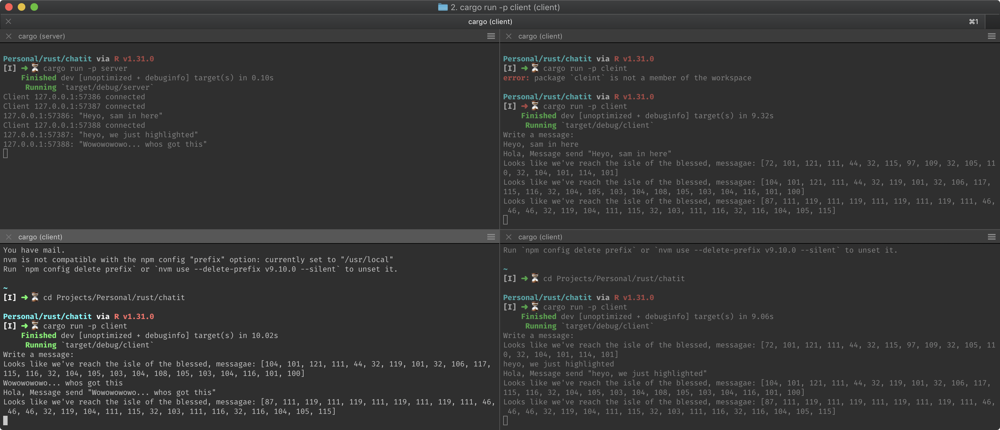

# Rust CLI Chat Thread Application

> Heyo, this is just some simple try of rust chat application using thread connection, ain't nothing special just getting a hang of this rust of a thing, feel free to clone and get to learn from it too.

This is a simple rust chat application between a server and multiple clients. The project makes use of rust workspace setup to have both server and client application in one module.

